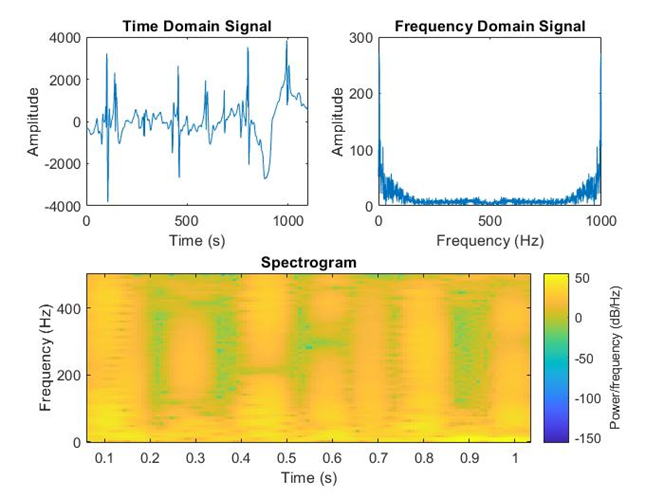
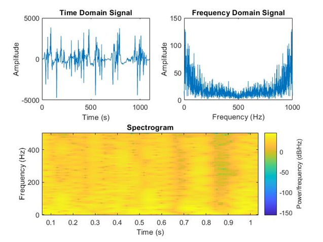
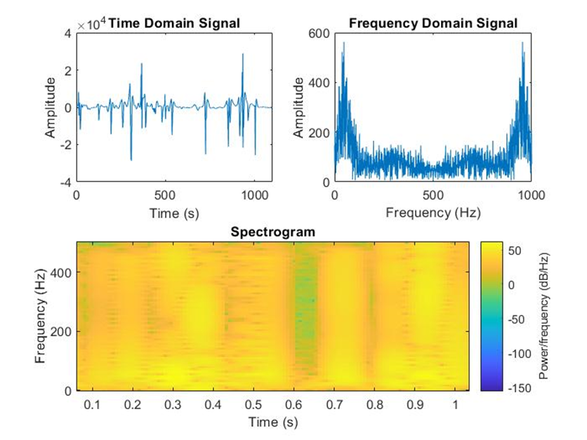
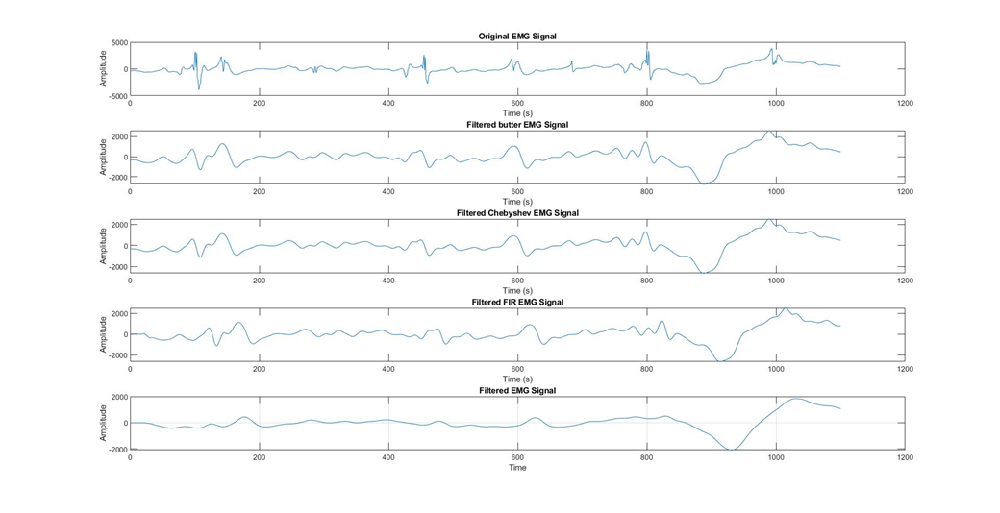
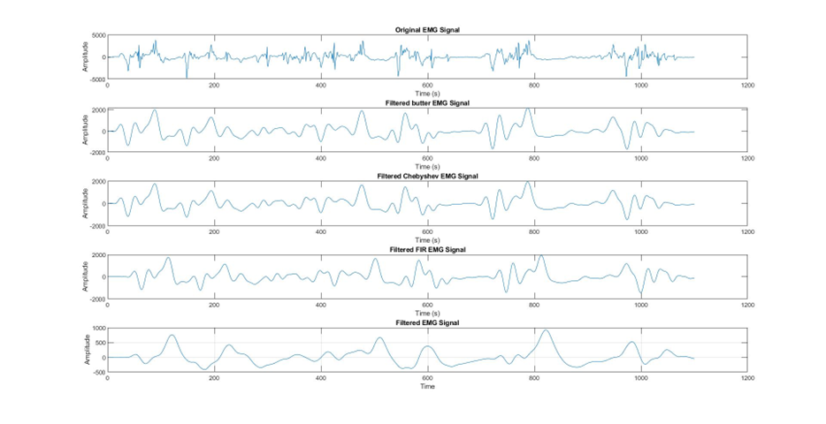
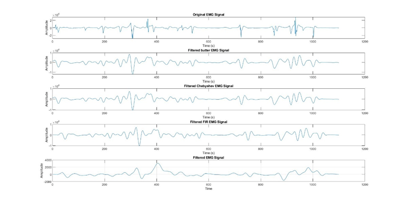
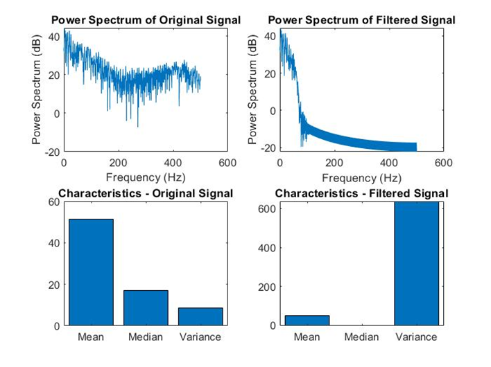
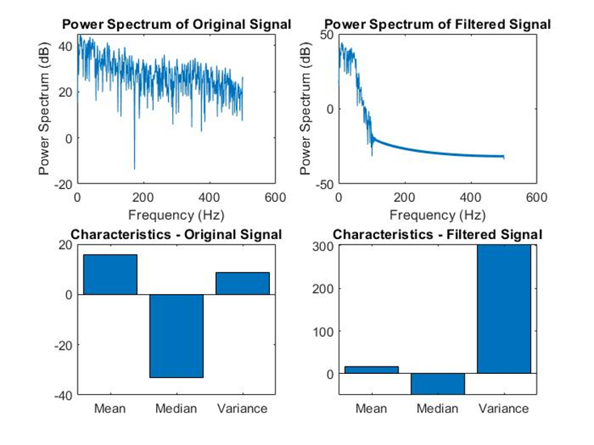
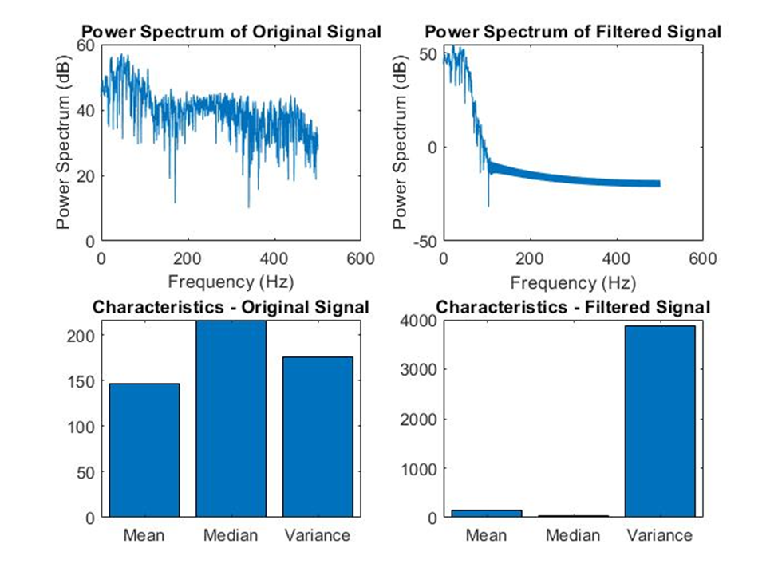
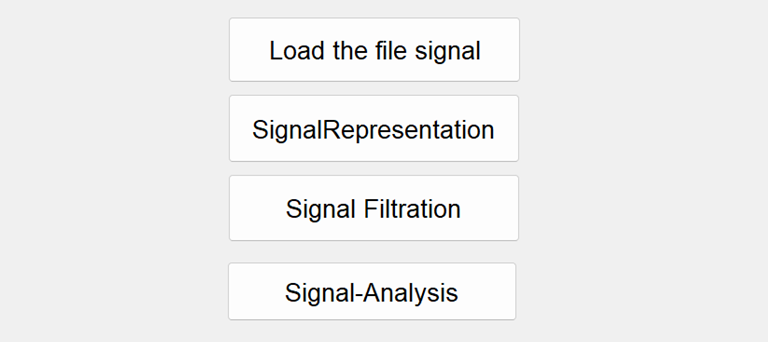

# 📌 EMG Signal Processing

## 📖 Introduction
Electromyography (EMG) signal processing plays a crucial role in clinical diagnostics and rehabilitation engineering. This project provides a Graphical User Interface (GUI) to facilitate EMG signal visualization, filtering, and analysis.

Users can load EMG signals, apply various filters, observe changes in both time and frequency domains, and analyze statistical characteristics. The system is designed to support the classification of healthy, myopathy, and neuropathy conditions.

## 🔥 Features

### ✅ Signal Representation
- Time-domain visualization to observe muscle activity
- Fourier Transform for frequency analysis
- Spectrogram for time-frequency representation
📌 Example Outputs:

### ✅ Signal Filtering
- Butterworth Filter (smooths signal)
- Chebyshev Filter (minimizes ripple effects)
- FIR Filter (linear-phase filtering)
- Notch Filter (removes powerline noise at 50/60 Hz)
📌 Example Outputs:

### ✅ Signal Analysis
- Computes Mean, Median, and Variance
- Power Spectrum Analysis using Welch's Method
- Detects abnormalities based on power levels
📌 Example Outputs:

### ✅ Graphical User Interface (GUI)
- Load and visualize EMG signals easily
- Apply multiple filters & analyze their effects
- View statistical computations in real-time
📌 GUI Example:

## 🚀 Installation & Usage

### Requirements
- MATLAB (R2023a or later)
- Basic knowledge of signal processing

### Running the GUI
1. Open MATLAB
2. Navigate to the project directory
3. Run `src/gui/Project.m`
4. Select EMG signals from the `/data/` directory
5. Use GUI buttons to visualize, filter, and analyze signals

## 📜 Documentation
Full documentation and implementation details are available in the `docs/` directory.

## 🤝 Contributors
[Mohamed Arafa]
- 📧 Email: mohamed2025arafa@gmail.com
- 🔗 LinkedIn: [https://www.linkedin.com/in/mohamed-s-arafa-438450218]

## 📢 Future Improvements
- Add machine learning for automated classification
- Enhance GUI with real-time processing
- Integrate deep learning models for anomaly detection